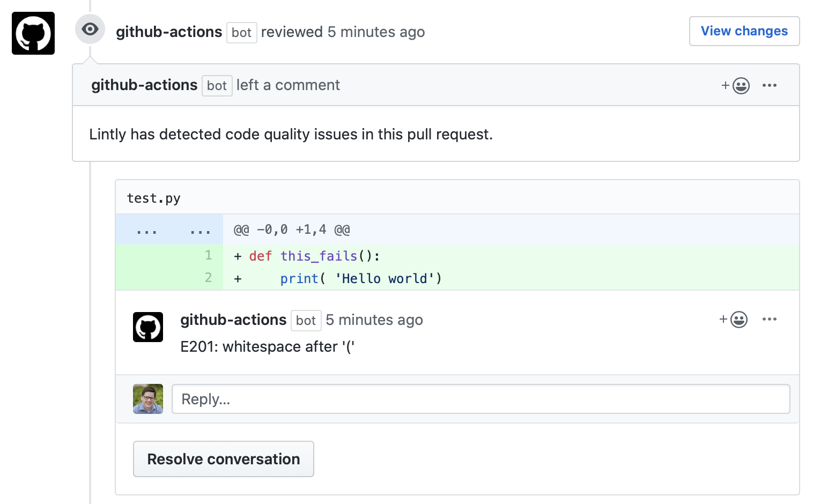

# Lintly-Flake8 GitHub Action

A GitHub Action that lints Python code with Flake8 then automatically creates pull request reviews if there are any violations. Uses [Lintly](http://github.com/grantmcconnaughey/Lintly) under the hood.

See [this pull request](https://github.com/grantmcconnaughey/lintly-flake8-github-action/pull/1#pullrequestreview-338419294) for an example.

## Usage

To use Lintly-Flake8 GitHub Action, add the following to a GitHub Actions workflow file such as `.github/workflows/main.yml`:

```yaml
on: [pull_request]

jobs:
  lint:
    runs-on: ubuntu-latest
    steps:
      - uses: actions/checkout@v1
      - uses: grantmcconnaughey/lintly-flake8-github-action@v1.0
        with:
          # The GitHub API token to create reviews with
          token: ${{ secrets.GITHUB_TOKEN }}
          # Fail if "new" violations detected or "any", default "new"
          failIf: new
          # Additional arguments to pass to flake8, default "." (current directory)
          args: "--ignore=E121,E123 ."
```

Now each PR created will be linted with Flake8. If there are any violations then Lintly will comment on the PR using the `github-actions` bot user.



**Note:** Lintly-Flake8 only works with the `pull_request` event. If your job runs on the `push` event then make sure the Lintly-Flake8 step only runs on the pull request event by adding `if: github.event_name == 'pull_request'`:

```yaml
      - uses: grantmcconnaughey/lintly-flake8-github-action@v1.0
        if: github.event_name == 'pull_request'
```
